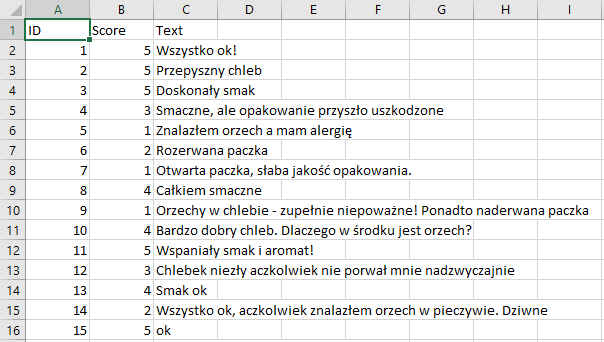
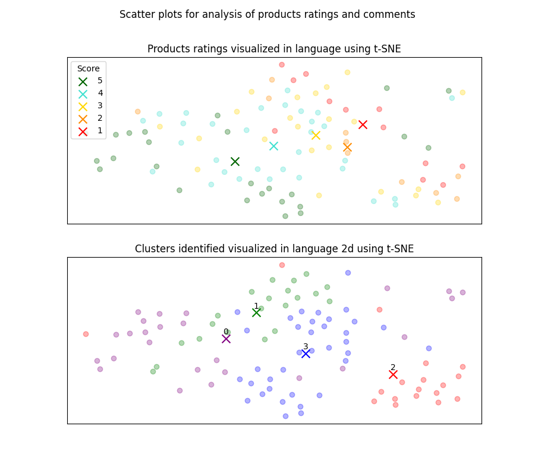
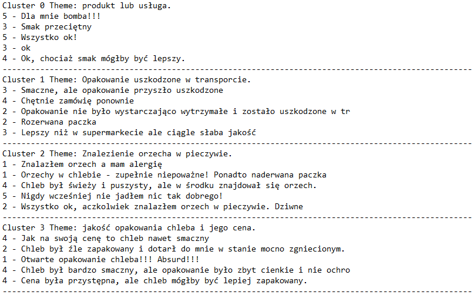

# Embeddings_OpenAI_2023
This short project focuses on testing solutions for access to OpenAI via API, clustering data and visualizing_embeddings_in_2D.
The project also shows that clustering is very promising and helpfull tool for discovering valuable, hidden groupings within the data.

## Input data
The dataset used in this project is bread reviews from imaginary online bakery. The reviews are in Polish to check the performance of the algorithm in Polish. The reviews tend to be positive or negative. Each review has a ID, Score and review body (Text).

  

## Output report
Report contains chart with identified (with simple k-means algorithm) clusters visualized in 2D using t-SNE transformation.
Also included is a text summary of each cluster made with text-davinci-003 based on a random sample of 5 reviews from that cluster.

  
   
  

